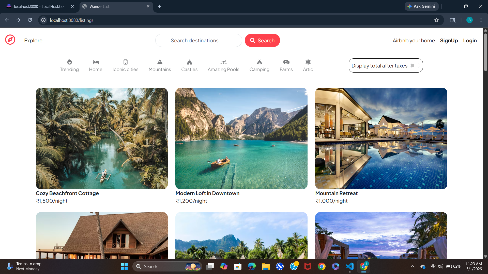
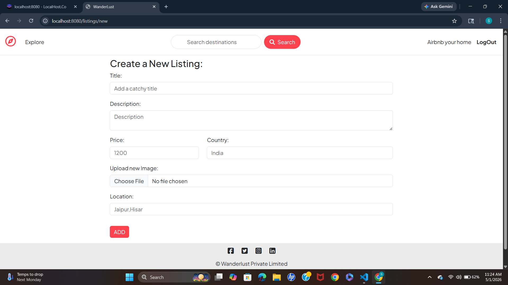
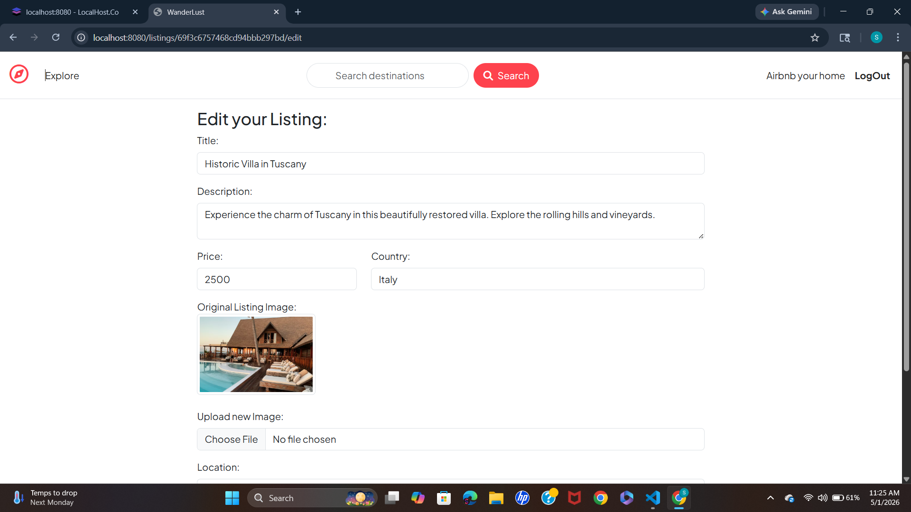
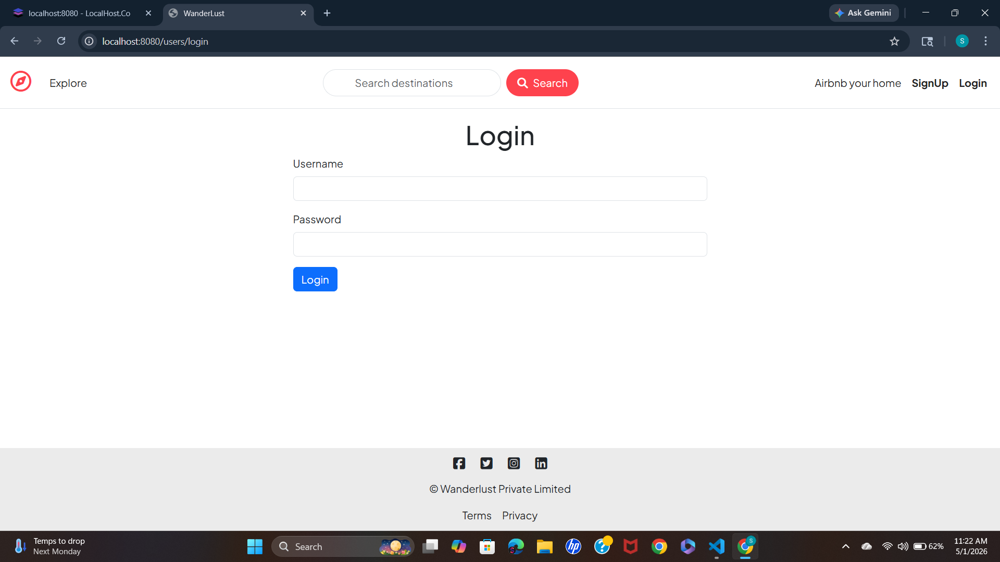
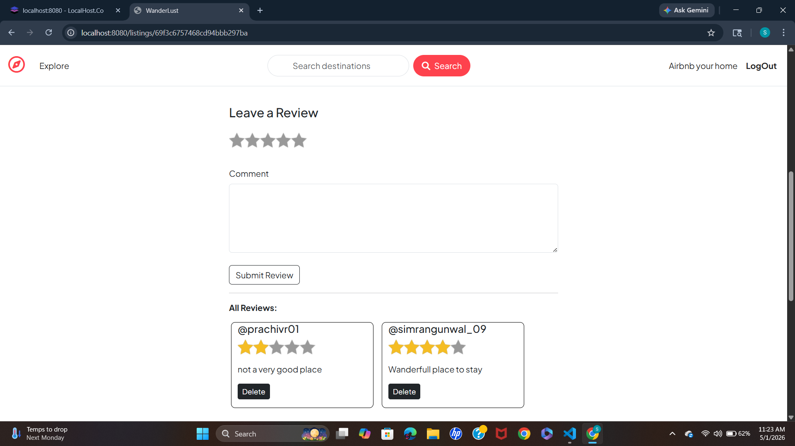
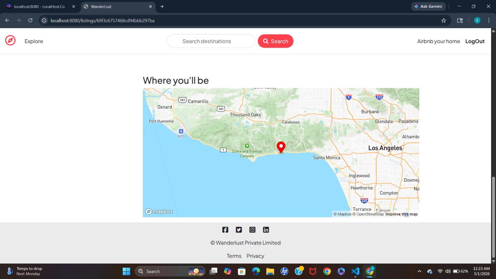

# Airbnb Clone

A full-stack Airbnb-inspired web application that allows users to explore, create, edit, and manage property listings with authentication, interactive maps, image uploads, and review functionality.

---

## 🚀 Live Features

- 🔐 User Authentication & Authorization
- 🏠 Create, Edit & Delete Listings
- 📍 Interactive Map Integration
- 🖼️ Property Image Uploads
- ⭐ Reviews & Ratings System
- 📱 Responsive User Interface
- 🔎 Browse and Explore Listings
- ⚡ RESTful Routing
- 🛡️ Secure Backend Architecture
- 💳 Razorpay Payment Integration
- 📅 Booking & Reservation System
- 🔍 Property Search & Filter
- 🌐 Mobile Responsive Design
---

## 🛠️ Tech Stack

### Frontend
- HTML
- CSS
- Bootstrap
- JavaScript
- EJS Templates

### Backend
- Node.js
- Express.js

### Database
- MongoDB
- Mongoose

### Other Tools & Libraries
- Passport.js
- Cloudinary
- Mapbox
- Express Session
- Connect Flash
- Method Override

---

## 📂 Project Structure

```bash
Airbnb_clone/
│
├── controllers/
├── init/
├── models/
├── public/
├── routes/
├── utils/
├── views/
├── app.js
├── cloudConfig.js
├── middleware.js
├── schema.js
├── package.json
└── README.md

```
## ⚙️ Installation & Setup

```bash
# Clone the repository
git clone https://github.com/Simran092004/airbnb-clone.git

# Move into project folder
cd airbnb-clone

# Install dependencies
npm install

# Run the application
node app.js
```

## Create a .env file
```bash
ATLASDB_URL=your_mongodb_url
SECRET=your_secret_key
MAP_TOKEN=your_mapbox_token
CLOUD_NAME=your_cloudinary_name
CLOUD_API_KEY=your_cloudinary_api_key
CLOUD_API_SECRET=your_cloudinary_secret
RAZORPAY_KEY_ID=your_razorpay_key_id
RAZORPAY_KEY_SECRET=your_razorpay_secret_key

```
## 📸 Screenshots

### Home Page


### Create Listing


### Edit Listing


### Login Page


### Reviews Section


### Map


---

# 🎓 Learning Outcomes

Through this project, I learned:

- Full-stack web development
- Backend development using Node.js and Express.js
- MongoDB database integration and CRUD operations
- RESTful API implementation
- MVC architecture
- Authentication and authorization
- Cloudinary image upload integration
- Session and cookie management
- Dynamic routing with Express
- EJS templating engine
- Responsive frontend development
- Error handling and middleware usage
- Razorpay payment gateway integration
- Booking and reservation system implementation
- Property search and filter functionality
- Interactive map integration using Mapbox
- Mobile responsive UI development
- Secure payment handling workflow
- Deployment-ready project structure
- Real-world application workflow

---

# 🔮 Future Improvements

- Add real-time chat between users
- Add AI-based property recommendations
- Add multilingual support
- Add property availability calendar
- Add email and SMS notifications
- Add review moderation system
- Add analytics dashboard for hosts
- Add social login authentication
- Improve accessibility and performance
- Add dark mode support

---

# 👨‍💻 Author

### Simran
B.Tech Student | Full Stack Developer

GitHub:
https://github.com/Simran092004

---

# ⭐ Support

If you like this project, give it a ⭐ on GitHub.
